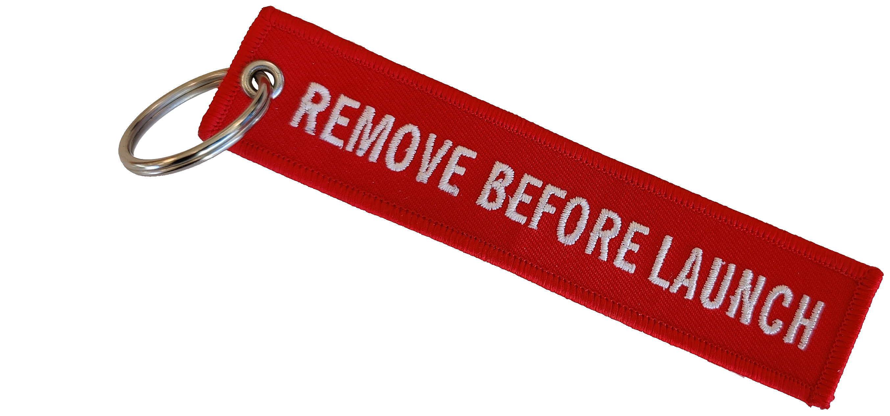
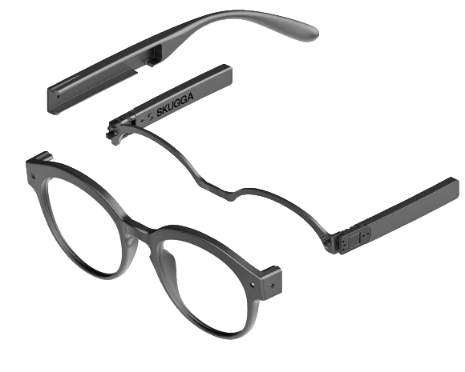
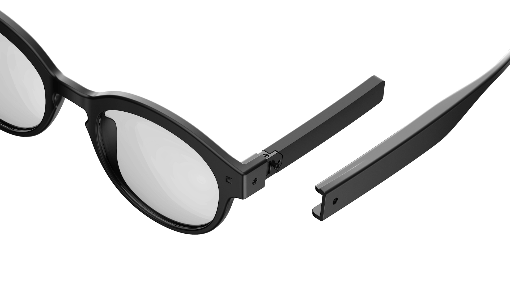
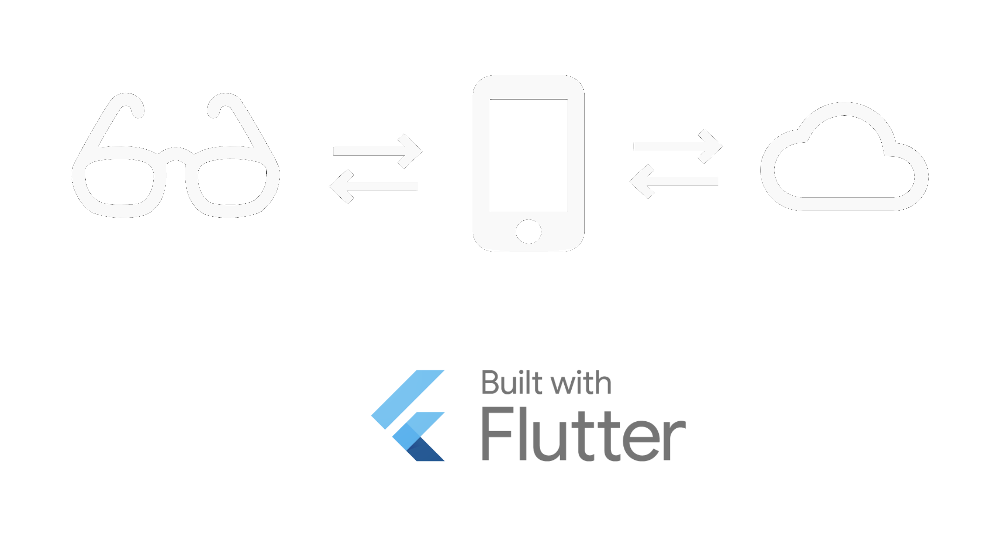
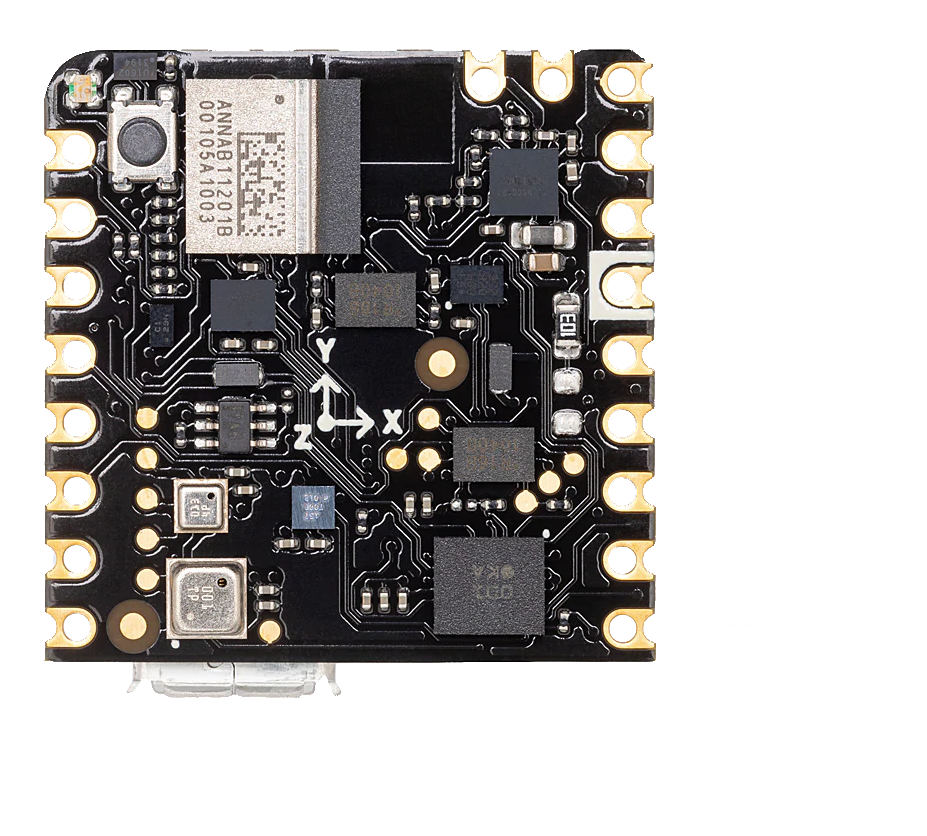
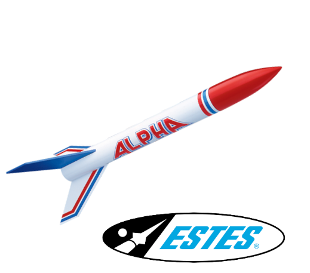

## Edward Patel

**@e_patel** / twitter
**epatel** / slack



---

# SKUGGA

> skugga.com



---

# We are hiring!

>

## Carin Ewald / HR

**carin.ewald@skugga.com**

>

http://**skugga.contact/carin**



---



---

# Alt Alpha

_a small side project_

> 

_work in progress_

---

# Arduino PRO / Nicla Sense ME



---

# Bosch sensors

* BMP390 - air pressure
* BHI260AP - accelerometer, gyro
* BMM150 - magnetic
* BME688 - gas (CO₂ and pollution), temperature, humidity

---

# more...

* supports BLE (Bluetooth Low Energy)
* small, 23 x 23 mm
* low weight, 2 grams 

---

# BLE (Bluetooth Low Energy)

>

**publish** & **subscribe**

organized as **services** with **characteristics**

---

# Flutter + BLE

>

`flutter pub add flutter_blue_plus`

---

# Step 1

_scan for devices_

`FlutterBluePlus.instance.startScan();`

>

_result stream_

`FlutterBluePlus.instance.scanResults`

---

# Step 2

_connect to device_

>

`scanResult.device.connect()`

---

# services & characteristics

UUID's (`uuidgen`)

> 

```
const serviceUUID = "65706174-...-68612E626C65";
const commandUUID = "65706174-...-2E636D642E2E";
const stateUUID = "65706174-...-2E7374617465";
const liveUUID = "65706174-...-2E6C6976652E";
const fetchUUID = "65706174-...-2E6665746368";
```

---

# Step 3

_probe the device_

```
final services = await device.discoverServices();
for (final s in services) {
    for (final c in s.characteristics) {
    }
  }
}
```

---

# Step 4

_setup listener_

`characteristic.value.listen(_update);`

>

_subscribe to characteristic_

`characteristic.setNotifyValue(true);`

---

# Step 5

_send data to the device_

>

`characteristic.write(_data)`

---

# Step 6

_Add error handling ... 💩 happens_

---

# 🤔 for what?

---

## Model Rockets

>

Reusable

Low weight



http://**smrk.space**

Fun!

Altitude? air pressure!

---

_5... 4... 3... 2... 1... lift off!_


---

# Demo

---

# End.

---

# We are hiring!

>

## Carin Ewald / HR

**carin.ewald@skugga.com**

>

http://**skugga.contact/carin**


